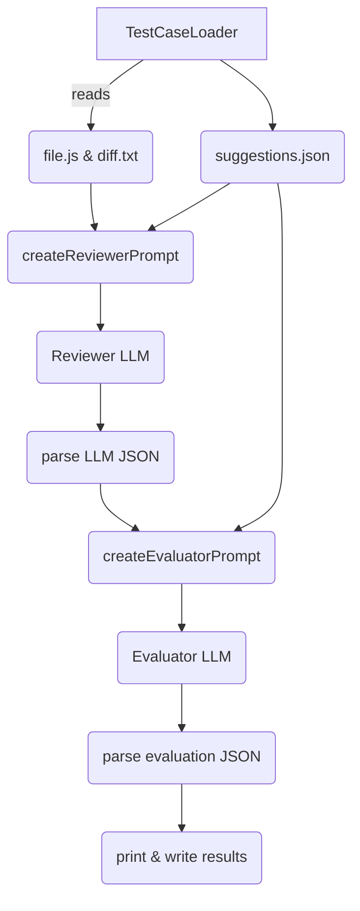

# Code Review Evaluator

A lightweight TypeScript framework that checks whether your **prompt-engineered code review** is actually detecting the same issues you defined as ground-truth.

The project loads sample code, asks an LLM to review it, compares the answer with an expected JSON, and returns an accuracy score – all with one command.

---

## 🌍 Repository Layout

```
.
├─ examples/               # Ground-truth samples (one folder per scenario)
│   ├─ api_request_manager/
│   │   ├─ file.js         # Original, buggy code
│   │   ├─ diff.txt        # Proposed changes (shown to the reviewer LLM)
│   │   └─ suggestions.json# Canonical analysis (ground truth)
│   └─ …                   # 6 more sample folders
├─ src/
│   ├─ llm/                # Vendor-specific wrappers (Gemini, OpenAI, Claude)
│   ├─ prompts.ts          # Prompt templates (reviewer & evaluator)
│   ├─ TestCaseLoader.ts   # Loads / parses the examples
│   ├─ Evaluator.ts        # Orchestrates the whole flow
│   ├─ index.ts            # CLI entry point (npm start / npm run dev)
│   └─ types.ts            # Strongly-typed data contracts
├─ evaluation_results.json # Generated after a run (accuracy report)
└─ package.json            # Scripts & dependencies
```

### Test-case folder structure

Each **example** is a sub-directory inside `examples/` and **must** contain exactly three files:

| file                | purpose                                                         |
|---------------------|-----------------------------------------------------------------|
| `file.(js|ts|jsx)`  | Original source code                                            |
| `diff.txt`          | Unified diff with your proposed changes                         |
| `suggestions.json`  | Ground-truth analysis in the expected JSON schema               |

> **Why both `file` and `diff`?**  The reviewer LLM receives *both* artefacts so it can see the current state **and** the intended patch, mimicking a typical pull-request review.

---

## 🚀 Quick Start

```bash
# 1 – Install deps
npm install

# 2 – Provide API keys (.env in project root)
OPENAI_API_KEY=sk-…
GEMINI_API_KEY=…
ANTHROPIC_API_KEY=…

# 3 – Run full evaluation (build + exec)
npm start

# 4 – Dev mode (no build, ts-node)
npm run dev
```

Running will:
1. Detect every folder in `examples/`
2. Call the **reviewer** LLM for each sample
3. Feed both ground-truth & LLM answer to the **evaluator** LLM
4. Print per-case accuracy and a global summary
5. Write `evaluation_results.json` with the raw data

---

## ⚙️ Configuration

Everything is code-first – open (or copy) `src/index.ts` and edit the `EvaluatorConfig`:

```ts
const config: EvaluatorConfig = {
  // Which LLM reviews the code
  reviewerLLM: {
    provider: 'gemini',                // 'gemini' | 'openai' | 'claude'
    model: 'gemini-2.5-pro-preview-06-05',
    apiKey: process.env.GEMINI_API_KEY!,
    temperature: 0,
  },
  // Which LLM judges the review
  evaluatorLLM: {
    provider: 'openai',
    model: 'gpt-4o-mini',
    apiKey: process.env.OPENAI_API_KEY!,
    temperature: 0,
  },
  // Optional: run only a subset of folders (default = all)
  testCases: ['api_request_manager', 'task_queue'],
};
```

Changing `provider` automatically switches to the right SDK thanks to `LLMFactory.ts`.

---

## 🧠 How It Works



1. **TestCaseLoader** reads each example and returns a typed object.
2. **Reviewer Prompt** (see `prompts.ts`) asks the first LLM to produce a JSON array of issues.
3. **Evaluator Prompt** compares that answer with ground-truth using a second LLM.
4. Accuracy is computed from the evaluator JSON and printed.

---

## 📤 Result Schema (`evaluation_results.json`)

```jsonc
[
  {
    "testCase": "api_request_manager",
    "overallMatch": true,
    "overallSimilarity": 93,
    "totalSuggestions": 5,
    "matchedSuggestions": 4,
    "accuracy": 80.0,
    "suggestionMatches": [
      {
        "groundTruth": {/* one suggestion */},
        "llmResponse": {/* matched suggestion or null */},
        "isMatch": true,
        "similarity": 95,
        "reasoning": "Both flagged missing retry on 500 errors…"
      }
    ],
    "detailedAnalysis": "…long string from evaluator LLM…"
  },
  "…more cases…"
]
```

---

## ➕ Adding New Examples

1. Create a new folder under `examples/`: `your_feature/`
2. Add `file.js`, `diff.txt`, `suggestions.json` following the same format.
3. Run `npm start` – the loader auto-discovers the new folder.

---

## 🔍 Internals / Source Guide

| file                               | role |
|------------------------------------|------|
| `src/llm/BaseLLM.ts`               | common abstract class (validates config) |
| `src/llm/GeminiLLM.ts`             | Wrapper around **@google/genai** (`GoogleGenAI`) |
| `src/llm/OpenAILLM.ts`             | Wrapper around **openai** SDK (Chat Completions) |
| `src/llm/ClaudeLLM.ts`             | Wrapper around **@anthropic-ai/sdk** |
| `src/llm/LLMFactory.ts`            | `switch` that instantiates the correct wrapper |
| `src/prompts.ts`                   | Markdown prompt templates with JSON specs |
| `src/TestCaseLoader.ts`            | Filesystem helper to read examples |
| `src/Evaluator.ts`                 | The orchestrator (loads ➜ prompts ➜ calls LLMs ➜ aggregates) |

---

## 🛠️ NPM Scripts

| script         | what it does                                           |
|----------------|--------------------------------------------------------|
| `npm run dev`  | Run `src/index.ts` directly with ts-node               |
| `npm start`    | Compile TypeScript ➜ run compiled `dist/index.js`      |
| `npm run test:dev` | Quick sanity test on the first available example |
| `npm run build`| Compile TypeScript to `dist/`                          |

---

## License

MIT 